# Screenshots

## ping_output
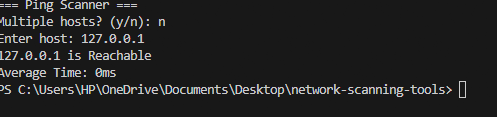

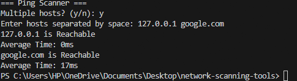

## ARP_output
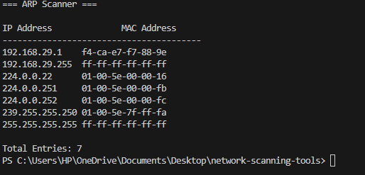

## Nmap_output
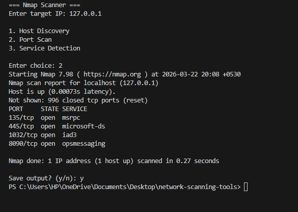

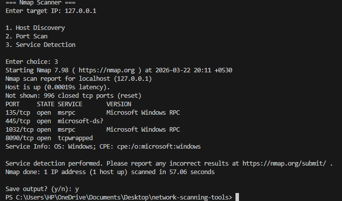

## Output_csv
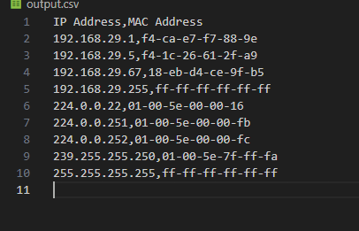

## Unified_Scanning

### output for choice 1:
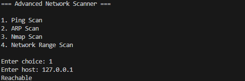

### output for choice 2:
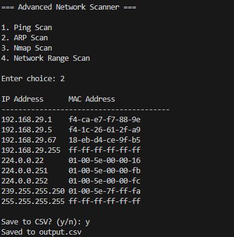

### output for choice 3:
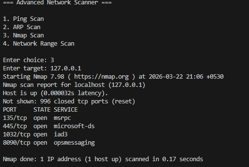

### output for choice4:
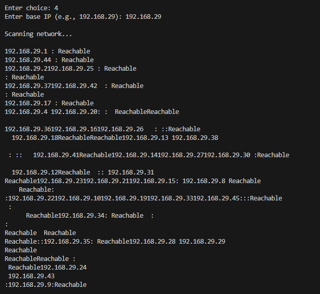

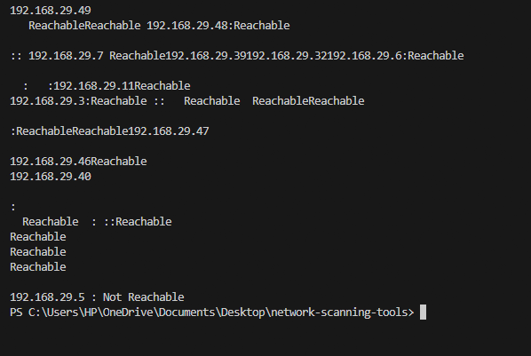
